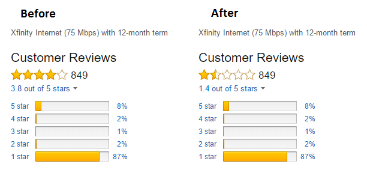
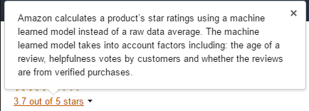

# amazon-review-corrector

Amazon's product review averages are deceptive.  They use a machine-learned model without providing the details of the weighting, which is not transparent.  It seems to agressively dismiss older reviews and place superficial emphasis on "verified purchases".

This Chrome Extension calculates and displays the true raw average of the reviews.

## Example

See the reviews for the following Xfinity offering: https://smile.amazon.com/Xfinity-Internet-Mbps-12-month-term/product-reviews/B01B6ZHZGE/



````
5 star: 7%
4 star: 2%
3 star: 2%
2 star: 2%
1 star: 87%
````

Amazon's reported rating: ````3.7/5 stars````

Actual average: ````((5*7)+(4*2)+(3*2)+(2*2)+(1*87))/100 = 140/100 = 1.4/5 stars````

Amazon reports a rating 2.3 stars higher than actually reflected by reviews.

## Amazon's excuse


````"Amazon calculates a product’s star ratings using a machine learned model instead of a raw data average. The machine learned model takes into account factors including: the age of a review, helpfulness votes by customers and whether the reviews are from verified purchases."````
